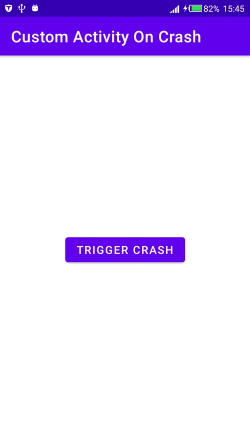
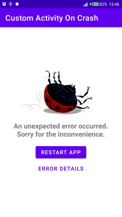
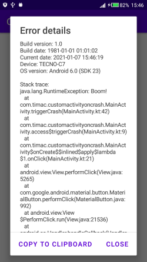

# Custom Activity On Crash

Dependency:

```kotlin
dependencies {
    compile 'cat.ereza:customactivityoncrash:2.3.0'
}
```

This library allows launching a custom activity when the app crashes, instead of showing the hated "Unfortunately, X has stopped" dialog.

Its a one step install although customizations can be made.

Trying it  
Force an app crash by throwing an uncaught exception, using something like this in your code:

```kotlin
throw new RuntimeException();
```

**Screenshots**  




> Link to my Implementation:
>
> - [MainActivity](./app/src/main/java/com/timac/customactivityoncrash/MainActivity.kt)

### Advanced setup

You can customize the behavior of this library in several ways by setting its configuration at any moment.
However, it's recommended to do it on your `Application` class so it becomes available as soon as possible.

Add a snippet like this to your `Application` class:

```java
@Override
public void onCreate() {
    super.onCreate();

    CaocConfig.Builder.create()
        .backgroundMode(CaocConfig.BACKGROUND_MODE_SILENT) //default: CaocConfig.BACKGROUND_MODE_SHOW_CUSTOM
        .enabled(false) //default: true
        .showErrorDetails(false) //default: true
        .showRestartButton(false) //default: true
        .logErrorOnRestart(false) //default: true
        .trackActivities(true) //default: false
        .minTimeBetweenCrashesMs(2000) //default: 3000
        .errorDrawable(R.drawable.ic_custom_drawable) //default: bug image
        .restartActivity(YourCustomActivity.class) //default: null (your app's launch activity)
        .errorActivity(YourCustomErrorActivity.class) //default: null (default error activity)
        .eventListener(new YourCustomEventListener()) //default: null
        .apply();
}
```

## Customization options

### Custom behavior

**Here is a more detailed explanation of each option that can be set using `CaocConfig.Builder`:**

```java
launchWhenInBackground(int);
```

> This method defines if the error activity should be launched when the app crashes while on background.
> There are three modes:
>
> - `CaocConfig.BACKGROUND_MODE_SHOW_CUSTOM`: launch the error activity even if the app is in background.
> - `CaocConfig.BACKGROUND_MODE_CRASH`: launch the default system error when the app is in background.
> - `CaocConfig.BACKGROUND_MODE_SILENT`: crash silently when the app is in background.
>
> The default is `CaocConfig.BACKGROUND_MODE_SHOW_CUSTOM`.

```java
enabled(boolean);
```

> Defines if CustomActivityOnCrash crash interception mechanism is enabled.
> Set it to `true` if you want CustomActivityOnCrash to intercept crashes,
> `false` if you want them to be treated as if the library was not installed.
> This can be used to enable or disable the library depending on flavors or buildTypes.
> The default is `true`.

```java
showErrorDetails(boolean);
```

> This method defines if the error activity must show a button with error details.
> If you set it to `false`, the button on the default error activity will disappear, thus disabling the user from seeing the stack trace.
> The default is `true`.

```java
trackActivities(boolean);
```

> This method defines if the library must track the activities the user visits and their lifecycle calls.
> This is displayed on the default error activity as part of the error details.
> The default is `false`.

```java
showRestartButton(boolean);
```

> This method defines if the error activity must show a "Restart app" button or a "Close app" button.
> If you set it to `false`, the button on the default error activity will close the app instead of restarting.
> If you set it to `true` and your app has no launch activity, it will still display a "Close app" button!
> The default is `true`.

```java
logErrorOnRestart(boolean);
```

> This controls if the stack trace must be relogged when the custom error activity is launched.
> This functionality exists because the Android Studio default Logcat view only shows the output for the
> current process. This makes it easier to see the stack trace of the crash. You can disable it if you
> don't want an extra log.
> The default is `true`.

```java
minTimeBetweenCrashesMs(boolean);
```

> Defines the time that must pass between app crashes to determine that we are not in a crash loop.
> If a crash has occurred less that this time ago, the error activity will not be launched and the system
> crash screen will be invoked.
> The default is `3000`.

```java
errorDrawable(Integer);
```

> This method allows changing the default upside-down bug image with an image of your choice.
> You can pass a resource id for a drawable or a mipmap.
> The default is `null` (the bug image is used).

```java
restartActivity(Class<? extends Activity>);
```

> This method sets the activity that must be launched by the error activity when the user presses the button to restart the app.
> If you don't set it (or set it to null), the library will use the first activity on your manifest that has an intent-filter with action
> `cat.ereza.customactivityoncrash.RESTART`, and if there is none, the default launchable activity on your app.
> If no launchable activity can be found and you didn't specify any, the "restart app" button will become a "close app" button,
> even if `showRestartButton` is set to `true`.
>
> As noted, you can also use the following intent-filter to specify the restart activity:
>
> ```xml
> <intent-filter>
>     <!-- ... -->
>     <action android:name="cat.ereza.customactivityoncrash.RESTART" />
> </intent-filter>
> ```

```java
errorActivity(Class<? extends Activity>);
```

> This method allows you to set a custom error activity to be launched, instead of the default one.
> Use it if you need further customization that is not just strings, colors or themes (see below).
> If you don't set it (or set it to null), the library will use the first activity on your manifest that has an intent-filter with action
> `cat.ereza.customactivityoncrash.ERROR`, and if there is none, a default error activity from the library.
> If you use this, the activity **must** be declared in your `AndroidManifest.xml`, with `process` set to `:error_activity`.
>
> Example:
>
> ```xml
> <activity
>     android:name="cat.ereza.customactivityoncrash.sample.CustomErrorActivity"
>     android:label="@string/error_title"
>     android:process=":error_activity" />
> ```
>
> As noted, you can also use the following intent-filter to specify the error activity:
>
> ```xml
> <intent-filter>
>     <!-- ... -->
>     <action android:name="cat.ereza.customactivityoncrash.ERROR" />
> </intent-filter>
> ```

```java
eventListener(EventListener);
```

> This method allows you to specify an event listener in order to get notified when the library shows the error activity, restarts or closes the app.
> The EventListener you provide can not be an anonymous or non-static inner class, because it needs to be serialized by the library. The library will throw an exception if you try to set an invalid class.
> If you set it to `null`, no event listener will be invoked.
> The default is `null`.

**More Customizations are in the library source Github Page: [Page](https://github.com/Ereza/CustomActivityOnCrash)**
