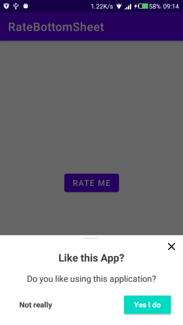

# RateBottom Sheet Impementation

**Dependency**

```xml
implementation 'com.mikhaellopez:ratebottomsheet:1.1.0'
```
Dependency page: [RateBottomSheet Github](https://github.com/lopspower/RateBottomSheet)

**Kotlin**

```kotlin
RateBottomSheetManager(this)
    .setInstallDays(1) // 3 by default
    .setLaunchTimes(2) // 5 by default
    .setRemindInterval(1) // 2 by default
    .setShowAskBottomSheet(false) // True by default
    .setShowLaterButton(false) // True by default
    .setShowCloseButtonIcon(false) // True by default
    .monitor()

// Show bottom sheet if meets conditions
// With AppCompatActivity or Fragment
RateBottomSheet.showRateBottomSheetIfMeetsConditions(this)
```

Override string xml resources on your application to change the texts in bottom sheet

```xml
<resources>
    <string name="rate_popup_ask_title">Like this App?</string>
    <string name="rate_popup_ask_message">Do you like using this application?</string>
    <string name="rate_popup_ask_ok">Yes I do</string>
    <string name="rate_popup_ask_no">Not really</string>

    <string name="rate_popup_title">Rate this app</string>
    <string name="rate_popup_message">Would you mind taking a moment to rate it? It won\'t take more than a minute. Thanks for your support!</string>
    <string name="rate_popup_ok">Rate it now</string>
    <string name="rate_popup_later">Remind me later</string>
    <string name="rate_popup_no">No, thanks</string>
</resources>
```

**LISTENER**  
When calling RateBottomSheet.showRateBottomSheetIfMeetsConditions(...) you can choose to add another parameter of type AskRateBottomSheet.ActionListener; this allows you to implement 3 optional callbacks. Here is how:

```kotlin
    this,
    listener = object : AskRateBottomSheet.ActionListener {
        override fun onDislikeClickListener() {
            // Will be called when a click on the "I don't like" button is triggered
        }

        override fun onRateClickListener() {
            // Will be called when a click on the "Rate" button is triggered
        }

        /*override fun onNoClickListener() {
            // Will be called when a click on the "No thanks" button is triggered,
            // in this example is commented,
            // but each callback is optional and it's up to you whether to implement it or not!
        }*/
    }
)
```

**DEBUG**  
Enable debugForceOpen to show bottom sheet without conditions check like this:

```kotlin
RateBottomSheetManager(this)
    .setDebugForceOpenEnable(true) // False by default

// Don't forget to run showRate function
RateBottomSheet.showRateBottomSheetIfMeetsConditions(this)
```

You can also enable logs with debugLogEnable properties:

```kotlin
RateBottomSheetManager(this)
    .setDebugLogEnable(true) // False by default
```

Clear all current data from RateBottomSheet like this:

```kotlin
RateBottomSheetManager(this)
    .clear()
```

## JAVA
You can call showRateBottomSheetIfMeetsConditions func like this:

```kotlin
RateBottomSheet.Companion.showRateBottomSheetIfMeetsConditions(this);
```

And because this library it's write in Kotlin you need to add kotlin-stdlib dependency on your java project:

```xml
implementation 'org.jetbrains.kotlin:kotlin-stdlib:1.3.71'

```

## **Sample**
[My Implementation Code](./app/src/main/java/com/timac/ratebottomsheet/MainActivity)

**Screenshots**  


