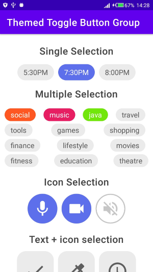
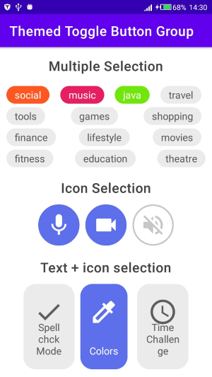
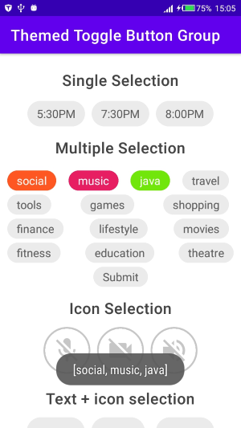

# ThemedToggleButtonGroup

Dependency:

```xml
dependencies {
  implementation 'nl.bryanderidder:themed-toggle-button-group:1.3.1'
  implementation 'com.google.android:flexbox:2.0.1'
}
```

Link to Dependency Github page: [ThemedToggleButtonGroup](https://github.com/Bryanx/themed-toggle-button-group#icon-selection)

Main xml: [activity_main.xml](./app/src/main/res/layout/activity_main.xml)

Listener Logic: [MainActivity](./app/src/main/java/com/timac/themedtogglebuttongroup/MainActivity.kt)

**Screenshots**  


